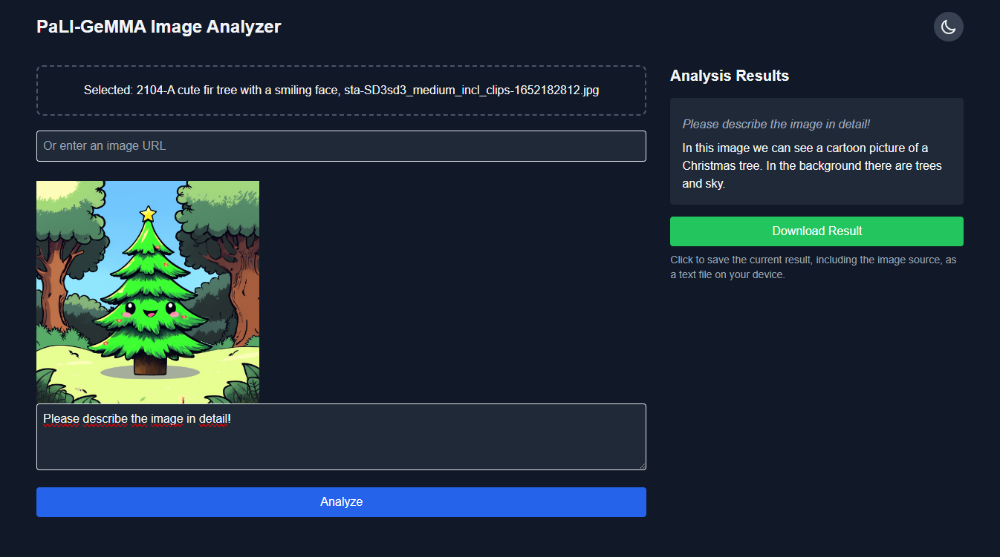

# PaLI-GeMMA Image Analyzer

PaLI-GeMMA Image Analyzer is a web application that utilizes the PaLI-GeMMA (Pathways Language and Image Model - Generalist Multimodal Agent) to analyze images based on user prompts. This application allows users to upload images or provide image URLs and ask questions or provide prompts about the image content.



## Features

- Drag and drop image upload from local files or web pages
- Image URL input support
- Real-time analysis streaming
- Responsive design with dark mode support
- Download analysis results as text files

## Prerequisites

- Python 3.9+
- Flask
- Transformers library
- PyTorch
- Hugging Face account and API token

## Installation

1. Clone the repository:
   ```
   git clone https://github.com/TanaroSch/PaliGemma.git
   cd PaliGemma
   ```

2. Create a virtual environment and activate it:
   ```
   python -m venv venv
   source venv/bin/activate  # On Windows, use `venv\Scripts\activate`
   ```

3. Install the required packages:
   ```
   pip install -r requirements.txt
   ```

4. Create a `.env` file in the project root and add your Hugging Face API token:
   ```
   HUGGINGFACE_TOKEN=your_token_here
   MODEL_CACHE_PATH=./model  # Optional: Set a custom path for model storage
   ```

   Note: If `MODEL_CACHE_PATH` is not set, the application will use `./model` as the default path.

## Usage

1. Start the Flask application:
   ```
   python app.py
   ```

2. Open a web browser and navigate to `http://localhost:5000`.

3. Upload an image by dragging and dropping it onto the page, or by providing an image URL.

4. Enter a prompt or question about the image in the text area.

5. Click "Analyze" or press Enter to start the analysis.

6. View the analysis results in real-time as they stream in.

7. Optionally, click "Download Result" to save the analysis as a text file.

## Custom Model Path

You can specify a custom path for storing the PaLI-GeMMA model by setting the `MODEL_CACHE_PATH` environment variable in your `.env` file. If not set, the application will use `./model` as the default path.

## Contributing

Contributions are welcome! Please feel free to submit a Pull Request.

## License

This project is licensed under the MIT License - see the [LICENSE](LICENSE) file for details.

## Acknowledgments

- PaLI-GeMMA model by Google
- Hugging Face for providing the model hosting and API